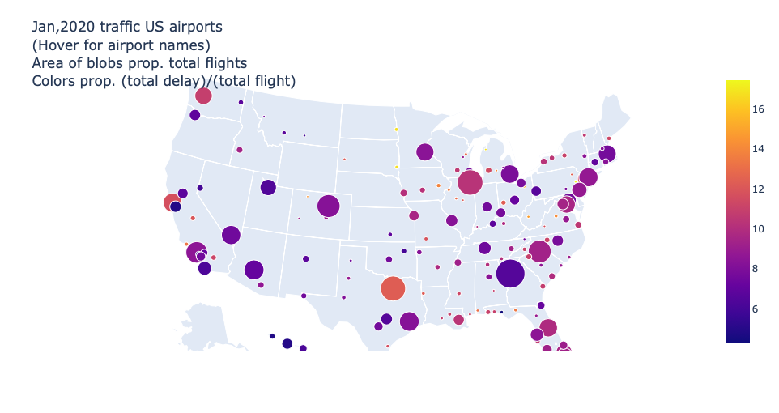

## Airline Data Analysis:

For this project I use data from Bureau of Transport Statistics. I have downloaded, cleaned and analyzed data for flights in US during January 2020. Explanations of the data is available here https://www.transtats.bts.gov/DL_SelectFields.asp?Table_ID=236&DB_Short_Name=On%20Time. I use pandas to analyze the data and use plotly to make an interactive visualization. On the plot one can hover the mouse over the US map and get information such as total flights, total delayed flights and delay per flight at the airports.  

- Take data where departure delay is reported. 
- Sort the data by date, take data for departure delay less than 500.
- remove airports that have less than 5 flights over the month.
- Screenshot of the plot 
 
airport_